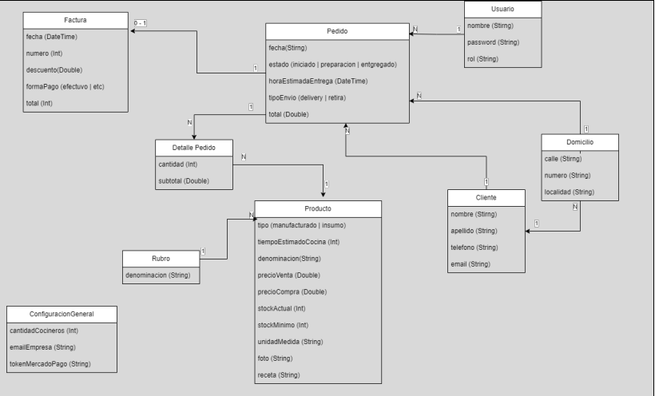

# PERSISTENCIA EN JPA 

Este repositorio contiene el código en Spring Boot sobre el siguiente diagrama UML

## OBJETIVO

El objetivo de este trabajo práctico es adquirir un entendimiento profundo de las anotaciones JPA en el contexto de Spring Boot y cómo se utilizan para mapear clases Java a tablas de una base de datos. Además, comprender las distintas formas de asociación entre clases en Hibernate en el contexto de una aplicación Spring Boot.

## REQUISITOS TÉCNICOS

- Utilizar Spring Boot y Gradle como sistema de gestión de dependencias.
- Configurar una base de datos H2 embebida y configurar la conexión en 
el archivo de configuración de Spring Boot.
- Crear las clases de entidad de Spring Boot correspondientes al modelo 
descrito, aplicando las anotaciones JPA necesarias para mapearlas a las 
tablas de la base de datos.

## INSTALACION

Descargar el proyecto y luego sobre la carpeta que se desee guardar, abrir la terminal y colocar el siguiente comando:

`git clone https://github.com/FlorGubiotti/PracticoProgramacion3.git`

Una vez hecho ya podrá abrir el proyecto correctamente, es necesario tener instalado el programa H2 para la base de datos. 
